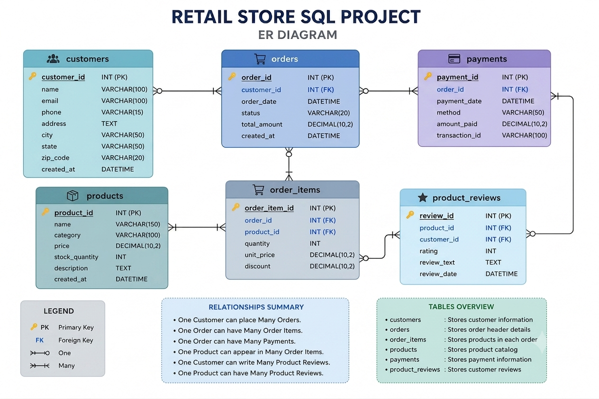

# 🛒 Retail Store SQL Project

<p align="center">


</p>

<p align="center">

</p>

---

# 📌 Project Overview

The **Retail Store SQL Project** is an end-to-end SQL portfolio project built using **MySQL**. It demonstrates database design, data insertion, and business-oriented SQL queries to solve real-world retail problems.

This project is designed to strengthen SQL skills required for **Data Analyst**, **Business Analyst**, and **SQL Developer** roles.

---

# 🎯 Project Objectives

- Design a relational retail database
- Create normalized database tables
- Insert realistic retail business data
- Perform SQL-based business analysis
- Practice SQL from beginner to advanced
- Build a professional GitHub portfolio project

---

# 🛠 Technologies Used

- MySQL 8.0
- MySQL Workbench
- SQL
- Git
- GitHub

---

# 📂 Project Structure

```text
Retail-Store-SQL-Project
│
├── database/
│   ├── create_database.sql
│   ├── create_tables.sql
│   ├── insert_data.sql
│   └── retail_store_database.sql
│
├── sql/
│   ├── Level-1_Basic_SQL.sql
│   ├── Level-2_Filtering_Formatting.sql
│   ├── Level-3_Aggregations.sql
│   ├── Level-4_Joins.sql
│   ├── Level-5_Subqueries.sql
│   └── Level-6_Set_Operations.sql
│
├── images/
│   ├── project_banner.png
│   ├── database_schema.png
│   ├── er_diagram.png
│   └── tables.png
│
├── report/
│   └── SQL_Project_Report.pdf
│
├── README.md
├── LICENSE
└── .gitignore
```

---

# 🗄 Database Schema

<p align="center">

</p>

---

# 📊 Entity Relationship Diagram (ERD)

<p align="center">

</p>

---

# 📋 Database Tables

| Table | Description |
|--------|-------------|
| Customers | Stores customer information |
| Products | Stores product details |
| Orders | Stores customer orders |
| Order_Items | Stores ordered products |
| Payments | Stores payment transactions |
| Product_Reviews | Stores customer reviews |

---

# 📚 SQL Concepts Covered

## ✅ Level 1 — Basic SQL

- SELECT
- WHERE
- DISTINCT
- ORDER BY
- BETWEEN
- LIKE
- IN

---

## ✅ Level 2 — Filtering & Formatting

- Aliases
- CONCAT()
- Calculated Columns
- LEFT JOIN
- IS NULL

---

## ✅ Level 3 — Aggregate Functions

- COUNT()
- SUM()
- AVG()
- ROUND()
- GROUP BY
- ORDER BY

---

## ✅ Level 4 — SQL JOINS

- INNER JOIN
- LEFT JOIN
- RIGHT JOIN
- Multi-table JOIN

---

## ✅ Level 5 — SQL Subqueries

- Single-row Subqueries
- Multi-row Subqueries
- Correlated Subqueries
- IN
- NOT IN
- MAX()
- AVG()

---

## ✅ Level 6 — Set Operations

- UNION
- DISTINCT
- INTERSECT Alternative (MySQL)

---

# 💼 Business Problems Solved

- Total Orders
- Total Revenue
- Average Order Value
- Customer Purchase Analysis
- Highest Spending Customers
- Products Never Ordered
- Customers Without Orders
- Category-wise Sales
- Product Performance
- Payment Analysis
- Customer Behaviour Analysis

---

# 🚀 How to Run

### Step 1

Clone the repository

```bash
git clone https://github.com/vikashrao627-glitch/Retail-Store-SQL-Project.git
```

---

### Step 2

Open MySQL Workbench

---

### Step 3

Execute database scripts in the following order:

```sql
create_database.sql

create_tables.sql

insert_data.sql
```

---

### Step 4

Navigate to the **sql/** folder and execute the SQL query files level by level.

---

# 📈 Skills Demonstrated

- SQL Query Writing
- Database Design
- Data Analysis
- Business Intelligence
- Data Cleaning
- Aggregate Functions
- SQL JOINS
- Subqueries
- Set Operations
- Business Reporting

---

# 📄 Project Report

The complete project report is available inside the **report/** folder.

```text
report/SQL_Project_Report.pdf
```

---

# 📷 Database Tables

<p align="center">

</p>

---

# ✨ Features

- Beginner to Advanced SQL
- 60+ SQL Queries
- Business-Oriented Problems
- Retail Database Design
- Professional SQL Formatting
- ER Diagram
- Database Schema
- GitHub Portfolio Ready

---

# ⭐ Repository Highlights

✅ End-to-End SQL Project

✅ Retail Store Database

✅ MySQL Workbench Compatible

✅ Real Business Case Studies

✅ 60+ SQL Queries

✅ Professional Documentation

✅ Beginner Friendly

✅ Portfolio Ready

---

# 👨‍💻 About Me

**Vikash Rao**

Aspiring **Data Analyst** passionate about SQL, Python, Excel, Power BI, and Data Visualization. I enjoy solving real-world business problems using data.

---

# 📬 Connect With Me

💼 **LinkedIn**

https://www.linkedin.com/in/vikash-rao-402044336

🐙 **GitHub**

https://github.com/vikashrao627-glitch

💻 **HackerRank**

https://www.hackerrank.com/profile/vikashrao627

---

## ⭐ If you found this project helpful, don't forget to Star ⭐ this repository.
